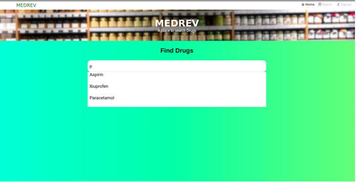
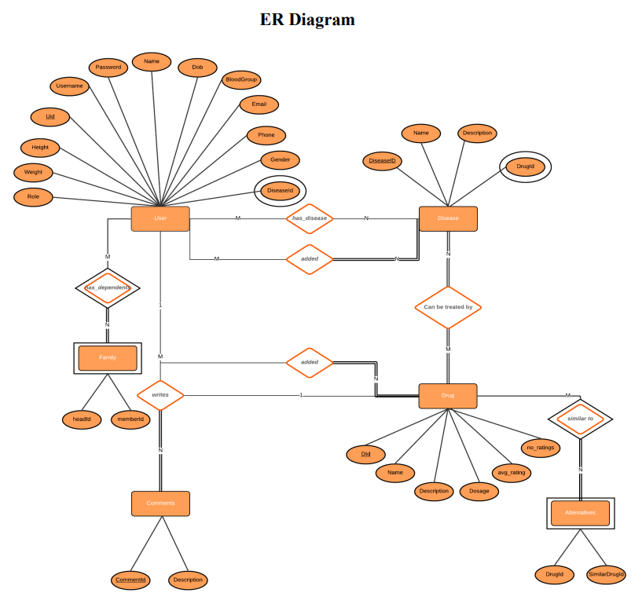

## Medicine Review System



## Installation Instructions
Prerequisites: Nodejs, Mysql, Vuejs

Create an empty MYSQL database with name <db_name>
```
sudo mysql -u root -p <db_name> < original_medrev.sql
```
Int the root directory
```
sh run_backend_server.sh
```
```
sh run_frontend_server.sh
```

### Team members
- [Harshvardhan R](https://github.com/AkshithBellare)
- [Laharish S](https://github.com/harsh2338)
- [Akshith N M](https://github.com/Laharish01)


